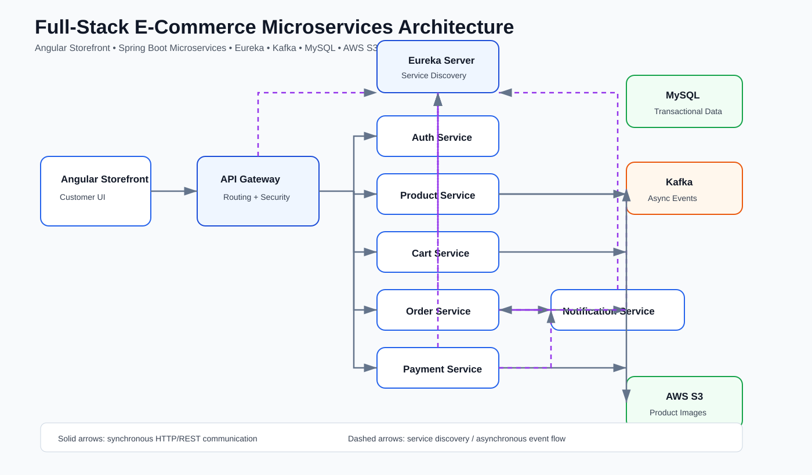

# 🛒 Full-Stack E-Commerce Microservices Platform

> A containerized e-commerce platform built with **Java, Spring Boot, Spring Cloud, Angular, Kafka, MySQL, AWS S3 and Docker**.


## 🚀 What I Built

This project demonstrates how a real-world e-commerce system can be split into independently deployable services. The frontend communicates through a single **API Gateway**, services register with **Eureka**, product images are handled through **AWS S3**, and asynchronous business events are processed with **Kafka**.

### Key capabilities

- JWT-based authentication and protected APIs
- API Gateway routing and centralized entry point
- Eureka service discovery
- Product catalog, categories, brands, sizes and images
- AWS S3-based product image handling
- User cart and product-price snapshot handling
- Order creation and order-state tracking
- Payment callback flow
- Kafka-based asynchronous payment/notification events
- Notification service for event consumption and email/console delivery
- Docker Compose orchestration
- GitHub Actions CI builds for backend services and Angular storefront

---

## 🏗️ Architecture



### Request and event flow

```text
Angular Storefront
        |
        v
   API Gateway
        |
        +--> Auth Service ---------> MySQL
        +--> Product Service ------> MySQL / AWS S3
        +--> Cart Service ---------> MySQL
        +--> Order Service --------> MySQL
        +--> Payment Service ------> Payment callback
        |
        v
     Eureka Server
   (service discovery)

Payment completed event
        |
        v
      Kafka Topic
      /         \
     v           v
Order Service   Notification Service
```

**Communication model:**
- REST for synchronous client/service operations
- Eureka for service discovery
- Kafka for asynchronous event-driven processing

---

## 🧩 Services

| Service | Port | Responsibility |
|---|---:|---|
| Eureka | 8761 | Service discovery |
| API Gateway | 8080 | Single entry point, routing and security |
| Auth Service | 9091 | Registration, login, BCrypt passwords and JWT issuance |
| Product Service | 9093 | Catalog, brands, categories, sizes and AWS S3 image handling |
| Cart Service | 9094 | Per-user cart and product-price snapshot |
| Order Service | 9095 | Order snapshots and payment state |
| Payment Service | 9096 | Payment intent and callback entry point |
| Notification Service | 9097 | Kafka consumer and notification delivery |
| Storefront | 4200 | Angular customer UI |

---

## 🛠️ Tech Stack

### Backend
- Java 17
- Spring Boot
- Spring Cloud
- Spring Security
- Spring Data JPA / Hibernate
- REST APIs
- JWT
- OpenFeign

### Frontend
- Angular
- TypeScript
- HTML / SCSS

### Data & Messaging
- MySQL
- Apache Kafka

### Cloud & DevOps
- AWS S3
- Docker / Docker Compose
- GitHub Actions
- Maven
- Git

---

## 🔐 Security

The platform uses JWT-based authentication. After login, the client receives an access token and sends it with protected requests:

```http
Authorization: Bearer <accessToken>
```

Passwords are stored using BCrypt hashing. Secrets and environment-specific credentials should remain outside Git through environment variables and `.env` files.

---

## ☁️ AWS S3 Integration

The Product Service configures:

- `S3Client` for S3 operations
- `S3Presigner` for pre-signed URL generation
- Configurable AWS region through application properties

This keeps image storage separate from application containers and supports scalable product media handling.

---

## 🐳 Run Locally

### 1. Clone the repository

```bash
git clone https://github.com/mantoshkumar9060/Ecommerce_Project.git
cd Ecommerce_Project
```

### 2. Configure environment values

Copy the example environment file and provide local values:

```powershell
Copy-Item .env.example .env
```

Do **not** commit real passwords, JWT secrets, AWS credentials or SMTP credentials.

### 3. Start the stack

```powershell
docker compose up --build -d
```

Check running containers:

```powershell
docker compose ps
```

### 4. Access the application

| Component | URL |
|---|---|
| Storefront | http://localhost:4200 |
| API Gateway | http://localhost:8080 |
| Eureka Dashboard | http://localhost:8761 |
| MySQL | localhost:3306 |
| Kafka | localhost:9092 |

---

## 📡 API Examples

### Register

```http
POST http://localhost:8080/api/v1/auth/register
Content-Type: application/json

{"name":"Demo User","email":"demo@example.com","password":"StrongPass123"}
```

### Login

```http
POST http://localhost:8080/api/v1/auth/login
Content-Type: application/json
```

Login returns an access token for protected requests.

### Add cart item

```http
POST http://localhost:8080/api/v1/carts/items
Authorization: Bearer <accessToken>

{"productId":1,"brandId":1,"quantity":2}
```

### Create order

```http
POST http://localhost:8080/api/v1/orders
Authorization: Bearer <accessToken>

{"shippingAddress":"Delhi, India - 110001"}
```

---

## 🧪 CI/CD

GitHub Actions builds the Angular storefront and backend services independently. The project currently uses automated build/test jobs to catch integration and compilation issues before further deployment work.

---

## 📸 Project Screenshots

The recommended showcase screenshots are:

1. Home page
2. Product listing
3. Product details
4. Cart
5. Address / checkout flow
6. Orders
7. Eureka dashboard with services registered as `UP`
8. GitHub Actions successful workflow

Screenshot capture guide: [docs/README_POLISH.md](docs/README_POLISH.md)

> Use real screenshots from the running project and remove any secrets or personal data before uploading them.

---

## 🔮 Next Improvements

- Inventory reservation and compensating actions for failed payments
- Provider-grade payment webhook signature verification
- Distributed tracing and centralized observability
- Redis caching where appropriate
- Integration tests with containers
- Production secret management
- Deployment to a cloud environment

---

## 👨‍💻 Author

**Mantosh Kumar**

GitHub: https://github.com/mantoshkumar9060

If this project is useful, consider starring the repository.
